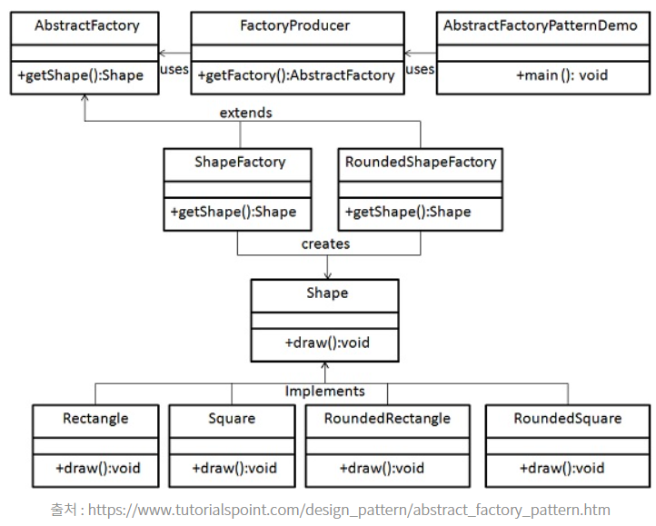

# Abstract Factory Pattern
---
## 개념
- 추상 팩토리 패턴은 기존 팩토리 패턴의 팩토리의 상위 팩토리를 통해 구체적인 팩토리를 생성한다

## 장점
- 객체를 생성하는 코드를 분리하여 클라이언트 코드와 결합도(의존성)를 찾춤
- 인터페이스를 바탕으로 유연성과 확장성이 뛰어난 코드
- 객체의 자료형이 하위 클래스에 의해서 결정됨
    - 확장이 용이
    - 상위 클래스에서 그 객체에 대한 정확한 타입을 몰라도 됨
- SOLID 원칙중 DIP(Dependency Inversion Principle, 의존 관계 역전 원칙)를 성립합

## 단점
- 새로 생성할 객체의 종류가 늘어날 때마다 클래스가 많아짐

## 구조

