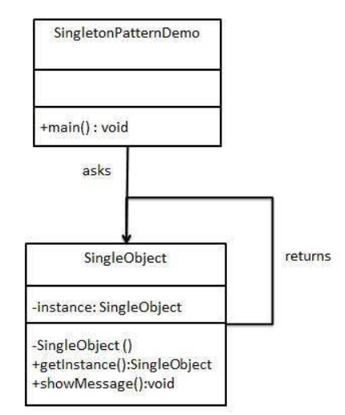

# Singleton Pattern
## 개념
- 단 하나의 인스턴스를 생성하여 사용하는 디자인 패턴

>인스턴스가 필요할 때 똑같은 인스턴스를 만들어내는 것이 아니라, 기존 인스턴스를 사용함

## 장점
- 하나의 인스턴스 사용 (메모리 낭비 방지)
- 전역 인스턴스 (다른 클래스의 인스턴스들이 데이터 공유)

## 단점
- 싱글톤 인스턴스가 너무 많은 일을 하거나 많은 데이터를 공유할 경우, 다른 클래스의 인스턴스들 간에 결합도가 높아져
SOLID 원칙 중 SRP, OCP 원칙에 위배된다. 즉, 수정 및 테스트가 어려워짐
- 멀티스레드 환경에서 동기화 처리를 하지 않으면 인스턴스가 두개 생성되는 경우가 발생될 수 있음.
- 꼭 필요한 경우가 아니면 지양 해야함.

## 활용 상황
- 공통된 객체를 여러 개 생성해서 사용해야 하는 경우
- 전역에서 사용될 하나의 객체를 만들어야 하는 경우 ex) DBCP(DB Connection Pool), Logger 등





## Eager Initialization
- Singleton의 가장 기본적인 방식
1. `static` 으로 전역 변수 instance를 선언하고 `private` 접근 제어 키워드를 사용해 외부에서 접근할 수 없도록 한다
2. EagerInitSingleObject의 생성자도 `private`를 사용하여 외부에서 객체를 생성할 수 없게 한다
3. instance 접근은 오직 정적 메소드인 `getInstance()`를 통해서만 접근 하도록하여 동일 인스턴스를 사용하는 기본 싱글톤 원칙을 지키게 한다   

- 소스코드
```java
public class EagerInitSingleObject{
    private static EagerInitSingleObject instance = new EagerInitSingleObject();
    
    // [Point] 생성자는 내부에서만 호출되게 한다
    private EagerInitSingleObject(){}
    
    public static EagerInitSingleObject getInstance(){
        return instance;
    }
}
```

- 장점
    - `static`으로 생성된 변수에 싱글톤 객체를 선언했기 때문에 Class loader 에 의해 클래스가 로딩될 때 싱글톤 객체가 생성됨
    - Class loader 에 의해 클래스가 최초 로딩될 때 객체가 생성되므로 **Thread-safe** 함
- 단점
    - 싱글톤 객체 사용유무와 관계 없이 클래스가 로딩되는 시점에 항상 생성됨
    - 사용유무에 관계없이 계속 메모리를 잡고있기 때문에 비효율적일 수 있음
    
## Lazy Initialization
- 클래스가 로딩되는 시점이 아닌 클래스의 인스턴스가 사용되는 시점에서 싱글톤 인스턴스를 생성

- 소스코드
```java
public class LazyInitSingleObject{
    private static LazyInitSingleObject instance;
    
    private LazyInitSingleObject(){}

    public static LazyInitSingleObject getInstance(){
        if(instance == null){
            instance = new LazyInitSingleObject();
        }
        return instance;
    }
}
```

- 장점
    - 싱글톤 객체가 필요할 때 인스턴스를 생성하기 때문에 메모리 누수를 방지한다

- 단점
    - Thread-safe 하지 않다. Multi-thread 환경에서 여로곳에서 동시에 `getInstance()`를 호출할 경우 인스턴스가 두번 생성될 여지가 있음
    
## Thread Safe Lazy Initialization
- Lazy Initialization 방식의 Thread-safe 하지 않다는 단점을 보완하기 위한 Initialization on demand holder idiom 방식
- `synchronized` 키워드를 사용하거나 `synchronized`+`Double-checked locking` 기법을 사용하는 방식도 있으나 아래와 같은 방식이 가장 많이 쓰임

```java
public class ThreadSafeLazyInitSingleObject {
    private ThreadSafeLazyInitSingleObject(){}

    private static class Holder{
        public static final ThreadSafeLazyInitSingleObject instance = new ThreadSafeLazyInitSingleObject();
    }

    public static ThreadSafeLazyInitSingleObject getInstance(){
        return Holder.instance;
    }
}
```

- 이 방법은 클래스 안에 클래스(Holder)를 두어 JVM의 Class loader의 매커니즘과 Class의 로드되는 시점을 이용하여 Lazy initialization 과 Thread-safe 를 보장한다
- 중첩 클래스 Holder는 `getInstance()` 메소드가 호출되기 전까진 참조되지 않으며 `getInstance()` 메소드가 호출 될 때 Class loader 에 의해 싱글톤 객체를 생성하여 리턴한다

> Holder 안에 선언된 instance가 static 이기 때문에 클래스 로딩ㅇ 시점에 한번만 호출 된다는 점을 이용한 것! ,또한 final을 써서 다시 값이 할당되지 않도록 함! 